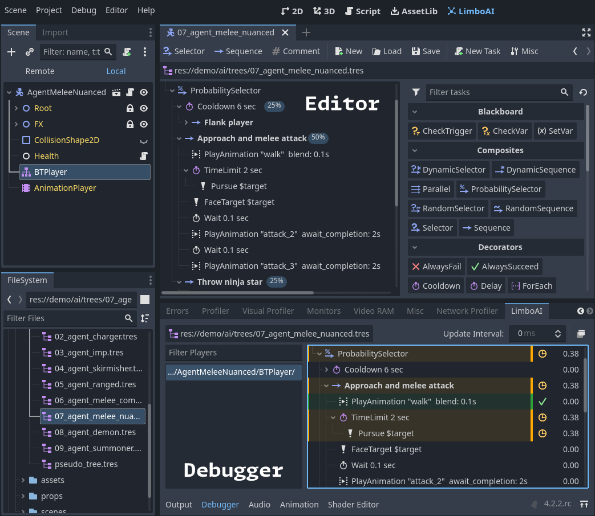
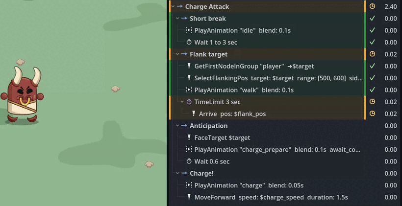

  

# LimboAI - Behavior Trees & State Machines for Godot 4

**LimboAI** is an open-source C++ plugin for **Godot Engine 4** providing a combination of
**Behavior Trees** and **State Machines**, which can be used together to create complex AI behaviors.
It comes with a behavior tree editor, built-in documentation, visual debugger, extensive demo project with a tutorial, and more!
While it is implemented in C++, it fully supports GDScript for [creating your own tasks](https://limboai.readthedocs.io/en/latest/getting-started/custom-tasks.html) and [states](https://limboai.readthedocs.io/en/latest/getting-started/hsm.html).

>**🛈 Supported Godot Engine: 4.2**

Behavior Trees are powerful hierarchical structures used to model and control the behavior of agents in a game (e.g., characters, enemies). They are designed to make it easier to create rich and highly modular behaviors for your games. To learn more about behavior trees, check out [Introduction to Behavior Trees](https://limboai.readthedocs.io/en/latest/getting-started/introduction.html) and our demo project, which includes a tutorial.

## Demonstration

### Videos

>**🛈 Demo project** lives in the `demo` folder and is available separately in [**Releases**](https://github.com/limbonaut/limboai/releases).
> Run `demo/scenes/game.tscn` to get started.
> It also contains a tutorial that introduces behavior trees using examples.

## Features

- **Behavior Trees (BT):**
    - Easily create, edit, and save `BehaviorTree` resources in the editor.
    - Execute `BehaviorTree` resources using the `BTPlayer` node.
    - Create complex behaviors by combining and nesting tasks in a hierarchy.
    - Control execution flow using composite, decorator, and condition tasks.
    - [Create custom tasks](https://limboai.readthedocs.io/en/latest/getting-started/custom-tasks.html) by extending core classes: `BTAction`, `BTCondition`, `BTDecorator`, and `BTComposite`.
    - Built-in class documentation.
    - Blackboard system: Share data seamlessly between tasks using the `Blackboard`.
      - Blackboard plans: Define variables in the BehaviorTree resource and override their values in the BTPlayer node.
      - Plan editor: Manage variables, their data types and property hints.
      - Blackboard scopes: Prevent name conflicts and enable advanced techniques like [sharing data between several agents](https://limboai.readthedocs.io/en/latest/getting-started/using-blackboard.html#sharing-data-between-several-agents).
      - Blackboard parameters: [Export a BB parameter](https://limboai.readthedocs.io/en/latest/getting-started/using-blackboard.html#task-parameters), for which user can provide a value or bind it to a blackboard variable (can be used in custom tasks).
      - Inspector support for specifying blackboard variables (custom editor for exported `StringName` properties ending with "_var").
    - Use the `BTSubtree` task to execute a tree from a different resource file, promoting organization and reusability.
    - Visual Debugger: Inspect the execution of any BT in a running scene to identify and troubleshoot issues.
    - Visualize BT in-game using `BehaviorTreeView` node (for custom in-game tools).
    - Monitor tree performance with custom performance monitors.

- **Hierarchical State Machines (HSM):**
    - Extend the `LimboState` class to implement state logic.
    - `LimboHSM` node serves as a state machine that manages `LimboState` instances and transitions.
    - `LimboHSM` is a state itself and can be nested within other `LimboHSM` instances.
    - [Event-based](https://limboai.readthedocs.io/en/latest/getting-started/hsm.html#events-and-transitions): Transitions are associated with events and are triggered by the state machine when the relevant event is dispatched, allowing for better decoupling of transitions from state logic.
    - Combine state machines with behavior trees using `BTState` for advanced reactive AI.
    - Delegation Option: Using the vanilla `LimboState`, [delegate the implementation](https://limboai.readthedocs.io/en/latest/getting-started/hsm.html#single-file-state-machine-setup) to your callback functions, making it perfect for rapid prototyping and game jams.
    - 🛈 Note: State machine setup and initialization require code; there is no GUI editor.

- **Tested:** Behavior tree tasks and HSM are covered by unit tests.

- **GDExtension:** LimboAI can be [used as extension](https://limboai.readthedocs.io/en/latest/getting-started/gdextension.html). Custom engine builds are not necessary.

- **Demo + Tutorial:** Check out our extensive demo project, which includes an introduction to behavior trees using examples.

## Getting LimboAI

LimboAI can be used as either a C++ module or as a GDExtension shared library. GDExtension version is more convenient to use but somewhat limited in features. Whichever you choose to use, your project will stay compatible with both and you can switch from one to the other any time. See [Using GDExtension](https://limboai.readthedocs.io/en/latest/getting-started/gdextension.html).

### Precompiled builds

- For the most recent builds, navigate to **Actions** → [**All Builds**](https://github.com/limbonaut/limboai/actions/workflows/all_builds.yml), select a build from the list, and scroll down until you find the **Artifacts** section.
- For release builds, check [**Releases**](https://github.com/limbonaut/limboai/releases).

### Compiling from source

>**🛈 For GDExtension:** Refer to comments in [setup_gdextension.sh](./gdextension/setup_gdextension.sh) file.

- Download the Godot Engine source code and put this module source into the `modules/limboai` directory.
- Consult the Godot Engine documentation for instructions on [how to build from source code](https://docs.godotengine.org/en/stable/contributing/development/compiling/index.html).
- If you plan to export a game utilizing the LimboAI module, you'll also need to build export templates.
- To execute unit tests, compile the engine with `tests=yes` and run it with `--test --tc="*[LimboAI]*"`.

## Using the plugin

- [Online Documentation](https://limboai.readthedocs.io/en/latest/index.html)
- [Introduction to Behavior Trees](https://limboai.readthedocs.io/en/latest/getting-started/introduction.html)
- [Creating custom tasks in GDScript](https://limboai.readthedocs.io/en/latest/getting-started/custom-tasks.html)
- [Sharing data using Blackboard](https://limboai.readthedocs.io/en/latest/getting-started/using-blackboard.html)
- [Accessing nodes in the scene tree](https://limboai.readthedocs.io/en/latest/getting-started/accessing-nodes.html)
- [State machines](https://limboai.readthedocs.io/en/latest/getting-started/hsm.html)
- [Using GDExtension](https://limboai.readthedocs.io/en/latest/getting-started/gdextension.html)
- [Using LimboAI with C#](https://limboai.readthedocs.io/en/latest/getting-started/c-sharp.html)
- [Class reference](https://limboai.readthedocs.io/en/latest/getting-started/featured-classes.html)

## Contributing

Contributions are welcome! Please open issues for bug reports, feature requests, or code changes. Keep the minor versions backward-compatible when submitting pull requests.

If you have an idea for a behavior tree task or a feature that could be useful in a variety of projects, open an issue to discuss it.

## Social

Need help? We have a Discord server: https://discord.gg/N5MGC95GpP

I write about LimboAI development on Mastodon: https://mastodon.gamedev.place/@limbo.

## Roadmap

Features and improvements that may be implemented in the future:
- ~~Providing precompiled builds for download.~~ 🗸
- ~~Tests and CI.~~ 🗸
- ~~GDExtension support.~~ 🗸
- ~~Extensive demo project.~~ 🗸
- Expanding the library of commonly useful tasks.
- Exploring the execution history of behavior trees in the visual debugger.
- Per-project ignore list for tasks that users may want to hide in the task palette.
- GUI editor for state machines.

## License

Use of this source code is governed by an MIT-style license that can be found in the LICENSE file or at https://opensource.org/licenses/MIT.
